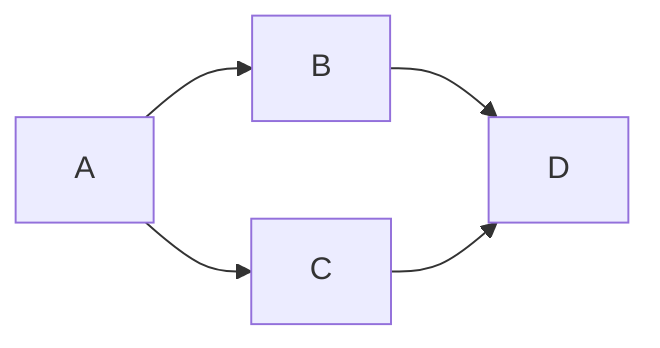
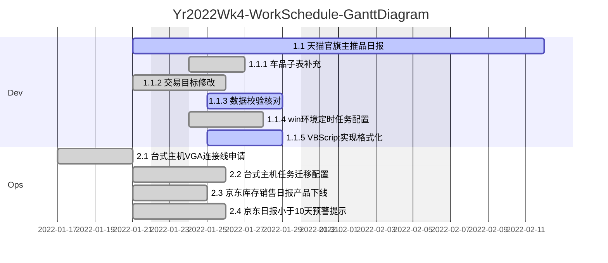

# nicolas-chan.github.io

博客参考模板： http://jekyllthemes.org/

nicechord 好和弦 https://nicechord.com/

```mermaid
graph LR;  
　　A-->B;    
　　A-->C;  
　　B-->D;  
　　C-->D;  
```

```mermaid
gantt
dateFormat  YYYY-MM-DD
title Yr2022Wk4-WorkSchedule-GanttDiagram
excludes 2022-01-22,2022-01-23,2022-01-30,2022-01-31,2022-02-01,2022-02-02,2022-02-03,2022-02-04,2022-02-05,2022-02-06
section Dev
1.1 天猫官旗主推品日报:active,2022-01-21,12d
1.1.1 车品子表补充:done,des1,2022-01-24,2022-01-27
1.1.2 交易目标修改:done,des2,2022-01-21,3d
1.1.3 数据校验核对:active,2022-01-25,4d
1.1.4 win环境定时任务配置:done,2022-01-24,4d
1.1.5 VBScript实现格式化:active,2022-01-25,4d

section Ops
2.1 台式主机VGA连接线申请:done,des1,2022-01-17,4d
2.2 台式主机任务迁移配置:done,des2, after des1, 3d
2.3 京东库存销售日报产品下线:done,des3,2022-01-21,2d
2.4 京东日报小于10天预警提示:done,des4,2022-01-21,3d
```
